# ADHD Demystified

This project is a concise, accessible one-page site that explains ADHD its common presentations, routes to diagnosis, and practical support options. It is aimed at people curious about ADHD, those seeking clear next steps, and allies looking for trustworthy resources. The repository includes the site source , a short success.html contact flow, and documentation (user stories, README).

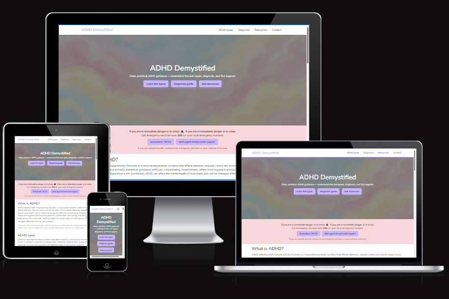

## Table Of Contents:

- [ADHD Demystified](#adhd-demystified)
  - [Table Of Contents:](#table-of-contents)
  - [Design \& Planning:](#design--planning)
    - [User Stories](#user-stories)
    - [Wireframes](#wireframes)
    - [Typography](#typography)
    - [Colour Scheme](#colour-scheme)
  - [Features:](#features)
    - [Navigation](#navigation)
    - [Hero](#hero)
    - [Symptoms checker](#symptoms-checker)
    - [Diagnosis pathway](#diagnosis-pathway)
    - [Resources and Tools](#resources-and-tools)
    - [Contact form](#contact-form)
    - [Footer](#footer)
  - [Technologies Used](#technologies-used)
  - [Testing](#testing)
    - [Google's Lighthouse Performance](#googles-lighthouse-performance)
    - [Browser Compatibility](#browser-compatibility)
    - [Responsiveness](#responsiveness)
    - [Code Validation](#code-validation)
    - [Manual Testing — User Stories](#manual-testing--user-stories)
  - [Bugs](#bugs)
  - [Deployment](#deployment)
      - [Deloying on Github](#deloying-on-github)
  - [Credits](#credits)

## Design & Planning:

### User Stories

1. Title: Clear homepage purpose

Story: As a Visitor, I want the homepage to communicate the site's purpose within 10 seconds so that I can decide whether it's relevant to me.

2. Title: Informational symptom & education cards

Story: As an Explorer user, I want easily browsable informational cards about symptoms and ADHD types so that I can learn, compare, and decide which next steps are relevant to me.

3. Title: Diagnosis information flow (informational links)

Story: As a Concerned adult/Parent, I want a clear informational flow with links so that I can learn how to get a diagnosis and take practical next steps.

4. Title: Mobile usability

Story: As a Mobile user, I want readable text and large tappable targets so that I can use the site comfortably on my phone.

5. Title: Keyboard & screen-reader navigation

Story: As an Accessibility-focused user, I want keyboard- and screen-reader-friendly tabs and navigation so that I can fully access content.

6. Title: Privacy-first contact form

Story: As a Contact form user, I want a simple, privacy-respecting contact form so that I can ask a question without oversharing.

7. Title: Resource accordion

Story: As a Resource seeker, I want a resource accordion with short summaries so that I can expand items to read details and find trusted sources quickly.

8. Title: Header anchor links

Story: As a Visitor, I want quick anchor links in the header so that I can jump to relevant sections without scrolling.

10. Title: Shareable resource links

Story: As a Clinician/Advocate, I want shareable resource links so that I can easily recommend specific items to others.

12. Title: Resource filters by audience

Story: As a Resource browser, I could filter resources by audience (Adults, Teens, Parents) so that I find relevant materials faster.

14. Diagnostic assessments online (WON'T)

Story: As a User, I will not be able to complete a clinical diagnostic assessment online; the site provides guidance and signposting only.

### Wireframes

I have sketeched out three different wireframes for different primary breakpoints these being mobile, tablet, and desktop in balsamiq.

### Typography
We use two simple, highly readable sans‑serif fonts from Google Fonts:

- Inter for body text due to its neutral lettering and clarity at small sizes.
- Nunito Sans for headings chosen for well‑balanced shapes that work well with my body text Inter.

Why these fonts?

- Simplicity and clarity: both fonts have clean, open glyphs that improve legibility for many readers.
- Accessibility-focused choices: a sans‑serif family which help readers with disabilities such as dyslexia find sans‑serif typefaces easier to read.

### Colour Scheme

I have decided to use a calming pastel colour theme, this is to provide the users with a calming and warm mood. I have generated the colour palette with [Vennage](https://venngage.com/tools/accessible-color-palette-generator). This website creates palettes that are Web Content Accessibility Guidelines (WCAG) compliant to help me ensure all users can read even if they have visual imparements.

## Features:

### Navigation

I have created a navigation bar that is responsive for both desktop and mobile users, once it gets to a mobile viewport it will automatically use a hamburger icons so users can get a drop down menu. For desktop users I have made it interactive on hover with a lilac coloured line underneath.

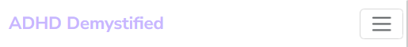

### Hero

I created a hero section with a cloud background to draw users into the site, it uses a pastel colour theme for the clouds to work with the house style. I have added text and a clear description of the website so users understand what they can learn, I have also included buttons on the website so that they can easily navigate to any section quickly on desktop or mobile.

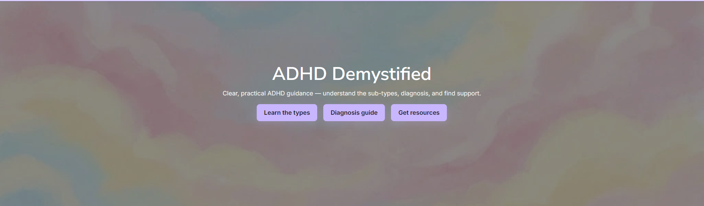

### Symptoms checker

I have added some of the criteria for ADHD and the different subtypes along with tabs to keep it easy for users to read what they need to instead of overwhleming them with information, is also has sub headings for each section on the combined part so they can differentiate and ensure they match the criteria for both as required.

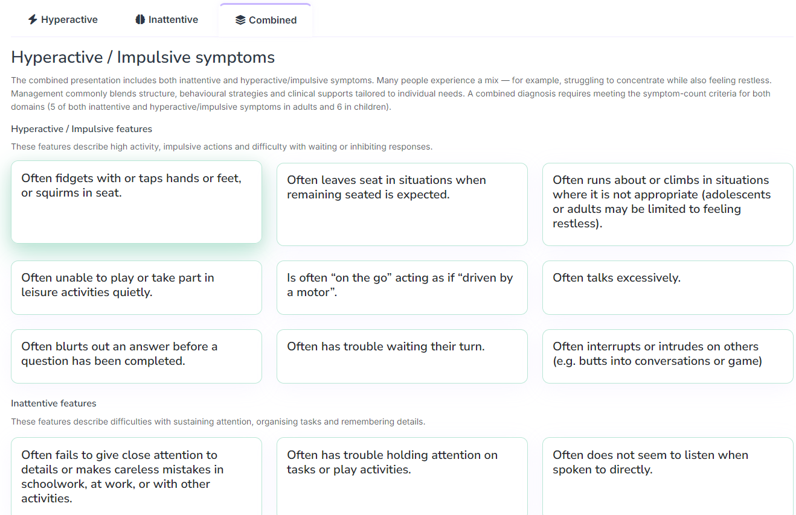

### Diagnosis pathway

I have created a simple diagnosis pathway using a few different cards, they also use Font Awesome icons to help break up the text, they also include relevant links to different resources that may be needed. It also notes that some information will depend on where the user lives as that is important in their care journey.

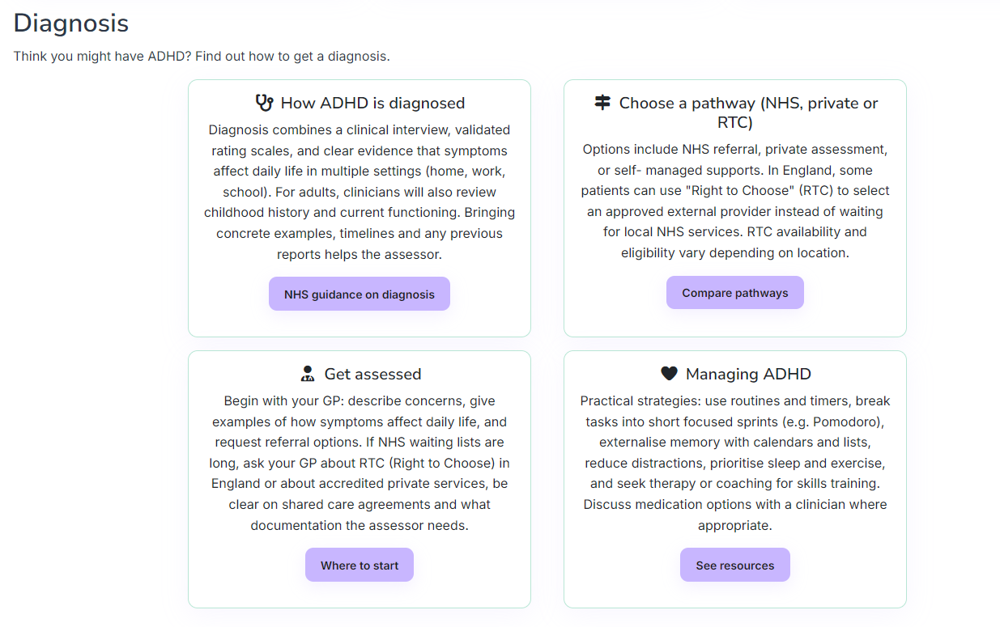

### Resources and Tools

I have created an accordion which links to various resources and tools, they all use icons from Font Awesome to help them be visually distinct, when the user hovers over the relevant resource a drop down appears and they will get a description and a link to the resource.

### Contact form

I have created a contact form which includes only the required fields, this respects privacy and stops the page from being clutterd with visual noise. I have also created a simple success.html to ensure that once the user submits the form they get some visual feedback knowing that their message has been sent.

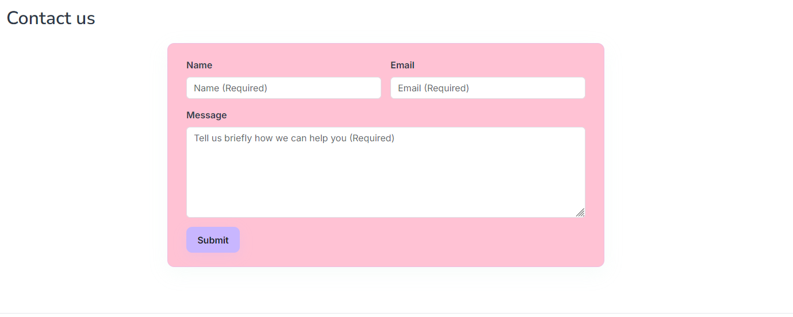

### Footer

I have created a simple footer with social media icons using Font Awesome, these link to the relevant social media mocking the behaviour that would be expected from a real website.

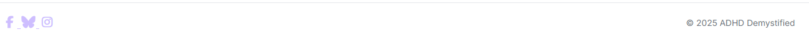

## Technologies Used

- HTML Semantic and accessible elements using HTML 5 standards.
- CSS custom styling using CSS variables for a clean style sheet.
- [Font Awesome](https://fontawesome.com/) Icons from Font Awesome to help provide visual cues for users.
- [Bootstrap](https://getbootstrap.com/) Bootstrap 5 for various pre-built components such as navbar, cards, and accordion.
- [Github](https://github.com/)  Source control with Git and remote repository hosting using GitHub. Site deployment also uses GitHub Pages.
- [GitHub Copilot](https://github.com/features/copilot) Assisted with code generation, and quick fixes for code issues.

## Testing

### Google's Lighthouse Performance

I have tested my website on Google Lighthouse on both desktop and mobile to ensure that it is performant, accessible, and adhears to best practices and SEO.

**Desktop**

**Mobile**

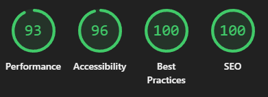

### Browser Compatibility

I have ensured browswer compatability with Firefox, Chrome and Safari.

### Responsiveness

I have ensured that various elements of my website respond to different screen size, mostly focusing on mobile, and desktop breakpoints.

Desktop navbar

Mobile navbar

Resources Desktop

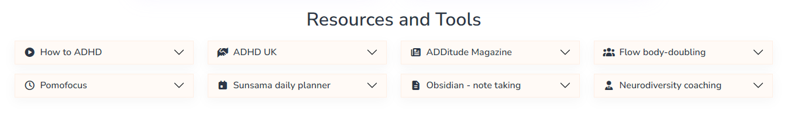

Resources Mobile

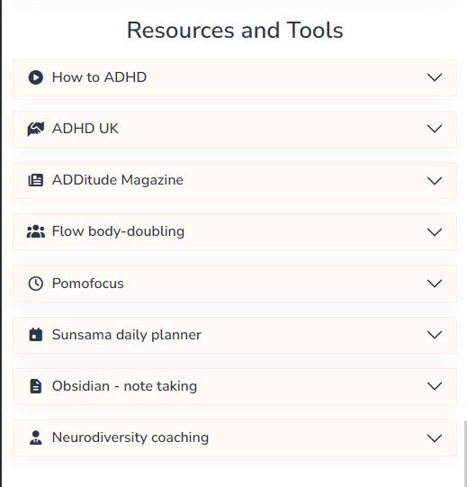

Symptoms Desktop

Symptoms Mobile

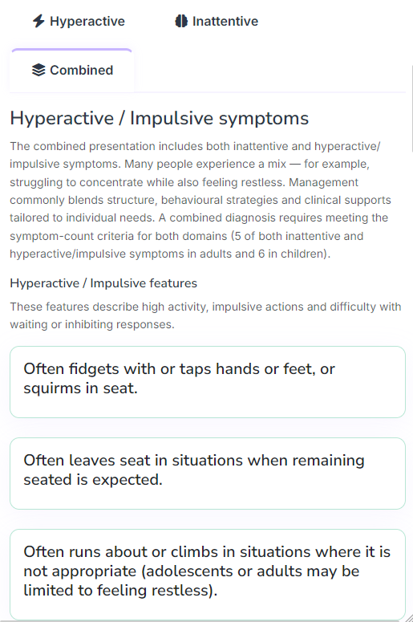

### Code Validation

I have validated my CSS and it has no errors on the W3C validator.

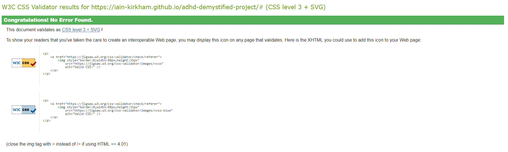

I have also validated my websites HTML through Nu Html Checker.

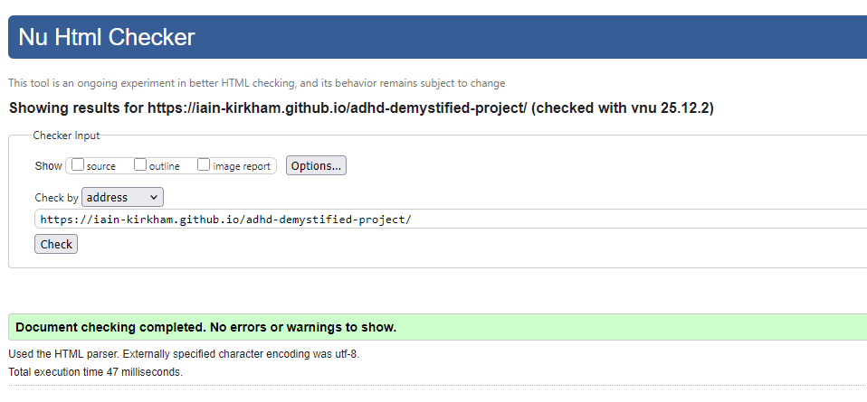

### Manual Testing — User Stories

Test each user story manually and record the expected behaviour and result. The entries below summarize manual checks for the main stories; all tests passed during manual verification.

User Story | Test | Pass
:--- | :--- | :---:
Clear homepage purpose | Load the homepage; verify hero shows the value proposition and at least one primary CTA visible without scrolling | ✅
Informational symptom & education cards | Open the symptoms/education section; verify cards load, show title, short description and link to more info | ✅
Diagnosis information flow (informational links) | Open the Diagnosis section; verify steps are visible with short explanations and external resource links | ✅
Mobile usability | Open site on a mobile-sized viewport (or device); check body text legibility and tappable targets (>=44×44 CSS px) | ✅
Keyboard & screen-reader navigation | Navigate site using keyboard only; verify focus order, visible focus states, and ARIA attributes on interactive elements | ✅
Privacy-first contact form | Submit the contact form with minimal fields; verify privacy note visible and success redirect to `success.html` | ✅
Resource accordion | Expand and collapse resources in the accordion; verify titles, summaries, and resource links are present and keyboard-operable | ✅
Header anchor links | Click header anchors; verify smooth scroll to target sections and active link is highlighted | ✅
Shareable resource links | Copy or open resource anchor/permalink; verify link resolves to the expected section or resource | ✅
Resource filters by audience (if enabled) | Apply audience filter; verify resource list updates to match selected audience tags | ✅

Attach screenshots for each test where required by your submission checklist.

## Bugs

List of bugs and how did you fix them

## Deployment

#### Deloying on Github

The site was deployed to Github Pages using the following method:

- Go to the Github repository.
- Navigate to the 'settings' tab.
- Using the 'select branch' dropdown menu, choose 'main'.
- Click 'save'.

## Credits

List of used resources for your website (text, images, snippets of code, projects....)

- **Code & Text Content:** Various code and text has been enhanced using GitHub Copilot.
- **Media:** Background hero image has been generated using [Gemini](https://gemini.google.com/app).

