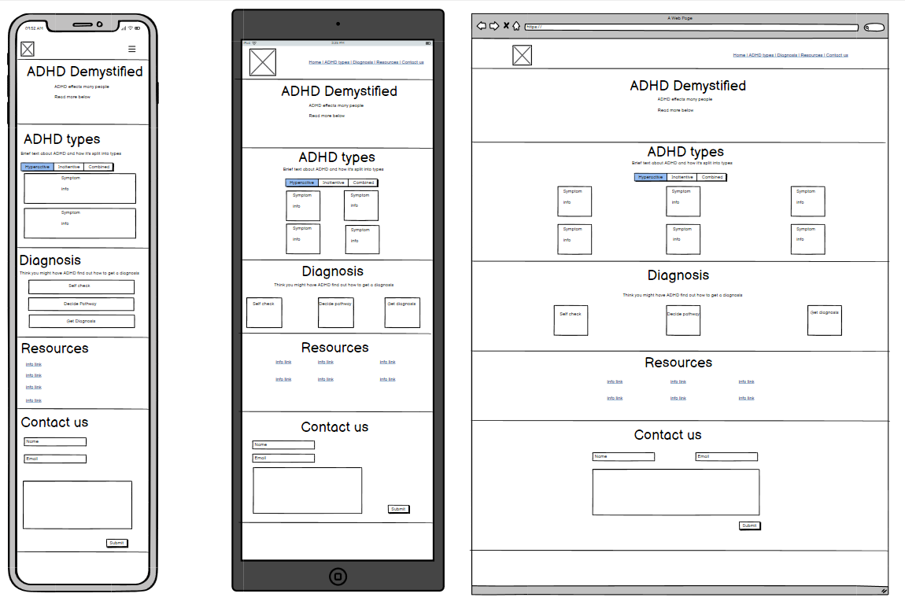
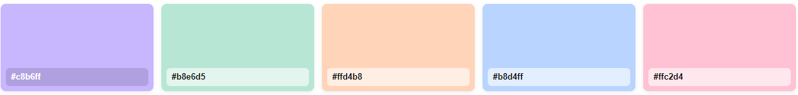

# ADHD Demystified

## Table Of Contents:

- [ADHD Demystified](#adhd-demystified)
  - [Table Of Contents:](#table-of-contents)
  - [Design \& Planning:](#design--planning)
    - [User Stories](#user-stories)
    - [Wireframes](#wireframes)
    - [Typography](#typography)
    - [Colour Scheme](#colour-scheme)
  - [Features:](#features)
    - [Navigation](#navigation)
    - [Footer](#footer)
    - [Other features](#other-features)
  - [Technologies Used](#technologies-used)
  - [Testing](#testing)
    - [Google's Lighthouse Performance](#googles-lighthouse-performance)
    - [Browser Compatibility](#browser-compatibility)
    - [Responsiveness](#responsiveness)
    - [Code Validation](#code-validation)
    - [Manual Testing user stories or/and features](#manual-testing-user-stories-orand-features)
  - [Bugs](#bugs)
  - [Deployment](#deployment)
      - [Creating Repository on GitHub](#creating-repository-on-github)
      - [Deloying on Github](#deloying-on-github)
  - [Credits](#credits)

## Design & Planning:

### User Stories

1. Title: Clear homepage purpose

Story: As a Visitor, I want the homepage to communicate the site's purpose within 10 seconds so that I can decide whether it's relevant to me.

2. Title: Informational symptom & education cards

Story: As an Explorer user, I want easily browsable informational cards about symptoms and ADHD types so that I can learn, compare, and decide which next steps are relevant to me.

3. Title: Diagnosis information flow (informational links)

Story: As a Concerned adult/Parent, I want a clear informational flow with links so that I can learn how to get a diagnosis and take practical next steps.

4. Title: Mobile usability

Story: As a Mobile user, I want readable text and large tappable targets so that I can use the site comfortably on my phone.

5. Title: Keyboard & screen-reader navigation

Story: As an Accessibility-focused user, I want keyboard- and screen-reader-friendly tabs and navigation so that I can fully access content.

6. Title: Privacy-first contact form

Story: As a Contact form user, I want a simple, privacy-respecting contact form so that I can ask a question without oversharing.

7. Title: Resource accordion

Story: As a Resource seeker, I want a resource accordion with short summaries so that I can expand items to read details and find trusted sources quickly.

8. Title: Header anchor links

Story: As a Visitor, I want quick anchor links in the header so that I can jump to relevant sections without scrolling.

10. Title: Shareable resource links

Story: As a Clinician/Advocate, I want shareable resource links so that I can easily recommend specific items to others.

12. Title: Resource filters by audience

Story: As a Resource browser, I could filter resources by audience (Adults, Teens, Parents) so that I find relevant materials faster.

14. Diagnostic assessments online (WON'T)

Story: As a User, I will not be able to complete a clinical diagnostic assessment online; the site provides guidance and signposting only.

### Wireframes

I have sketeched out three different wireframes for different primary breakpoints these being mobile, tablet, and desktop in balsamiq.

### Typography
We use two simple, highly readable sans‑serif fonts from Google Fonts:

- Inter for body text due to its neutral lettering and clarity at small sizes.
- Nunito Sans for headings chosen for well‑balanced shapes that work well with my body text Inter.

Why these fonts?

- Simplicity and clarity: both fonts have clean, open glyphs that improve legibility for many readers.
- Accessibility-focused choices: a sans‑serif family which help readers with disabilities such as dyslexia find sans‑serif typefaces easier to read.

### Colour Scheme

I have decided to use a calming pastel colour theme, this is to provide the users with a calming and warm mood. I have generated the colour palette with [Vennage](https://venngage.com/tools/accessible-color-palette-generator). This website creates palettes that are Web Content Accessibility Guidelines (WCAG) compliant to help me ensure all users can read even if they have visual imparements.

## Features:

### Navigation

### Footer

### Other features

## Technologies Used

HTML
CSS
[Bootstrap](https://getbootstrap.com/)
[Github](https://github.com/)

## Testing

### Google's Lighthouse Performance

I have tested my website on Google Lighthouse on both desktop and mobile to ensure that it is performant, accessible, and adhears to best practices and SEO.

### Browser Compatibility

Check compatability with different browsers

### Responsiveness

Screenshots of the responsivness, pick few devices (from 320px top 1200px)

### Code Validation

Validate your code HTML, CSS (all pages/files need to be validated!!!), display screenshots

### Manual Testing user stories or/and features

Test all your user stories, you an create table
User Story | Test | Pass
--- | --- | :---:
paste here you user story | what is visible to the user and what action they should perform | &check;

- and attach screenshot

## Bugs

List of bugs and how did you fix them

## Deployment

#### Creating Repository on GitHub

- First make sure you are signed into [Github](https://github.com/) and go to the code institutes template, which can be found [here](https://github.com/Code-Institute-Org/gitpod-full-template).
- Then click on **use this template** and select **Create a new repository** from the drop-down. Enter the name for the repository and click **Create repository from template**.
- Once the repository was created, I clicked the green **gitpod** button to create a workspace in gitpod so that I could write the code for the site.

#### Deloying on Github

The site was deployed to Github Pages using the following method:

- Go to the Github repository.
- Navigate to the 'settings' tab.
- Using the 'select branch' dropdown menu, choose 'main'.
- Click 'save'.

## Credits

List of used resources for your website (text, images, snippets of code, projects....)

- Code & Text Content

- Media

- Acknowledgment
